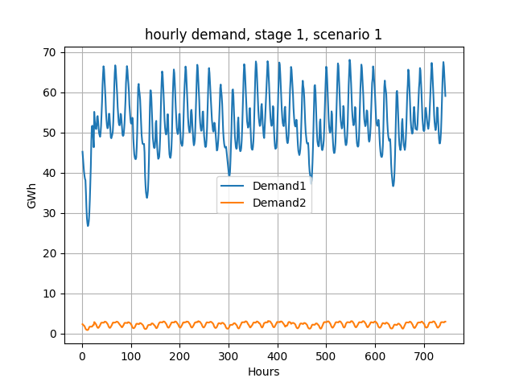

PyGraf
======


Utility module to read Sddp hdr/bin result file pairs. Some examples to convert it to popular formats are available.


Usage
-----

Start by importing `psr.graf` module. It's possible to read data directly using `open_bin` function or `load_as_dataframe` function if `pandas` package is available.


The example below shows how to load data directly into a `pandas.DataFrame` and prints the first 5 lines of data.

```python
import psr.graf

df = psr.graf.load_as_dataframe("sample_data/gerter.hdr")
print(df.head())

```

The output is:
```
   stage  scenario  block  Thermal 1  Thermal 2  Thermal 3
0      1         1      1   7.440000      0.744   0.368069
1      1         2      1   6.437624      0.000   0.000000
2      1         3      1   7.440000      0.744   0.576140
3      1         4      1   7.440000      0.744   2.994997
4      1         5      1   7.440000      0.744   0.916644
```

Alternatively, `open_bin` function can be used for direct data access as shown in the example next.

```python
import psr.graf

with psr.graf.open_bin("sample_data/gerter.hdr") as graf_file:
    print("Stages:", graf_file.stages)
    print("Scenarios:", graf_file.scenarios)
    print("Agents:", graf_file.agents)
    print("Initial date: {:04d}/{:02d}"
          .format(graf_file.initial_year, graf_file.initial_month))
    print("Units:", graf_file.units)
    stage = 2
    scenario = 10
    print("Number of blocks at stage {}: {}"
          .format(stage, graf_file.blocks(stage)))
    block = 1
    print("Data at stage {}, scenario {}, block {}:"
          .format(stage, scenario, block), graf_file.read(1, 1, 1))
```

The output is:
```
Stages: 12
Scenarios: 50
Agents: ['Thermal 1', 'Thermal 2', 'Thermal 3']
Initial date: 2013/01
Units: GWh
Number of blocks at stage 2: 1
Data at stage 2, scenario 10, block 1: (7.440000057220459, 0.7440000176429749, 0.3680693209171295)
```


Usage Samples
-------------

### [`dataframes_sample.py`](dataframes_sample.py)

Shows how to read data into `pandas.DataFrame`s.

Requires `pandas` package installed.


### [`matplotlib_sample.py`](matplotlib_sample.py)

Shows how to read data and plot data from hdr/bin file pairs.



Requires `matplotlib` package installed.


### [`csv_sample.py`](csv_sample.py)

Shows how to convert from hdr/bin file pairs to csv using `psr.graf` module.

This script can also be called from command line:

```bat
python csv_sample.py input_file.hdr output_file.csv
```

Where `output_file.csv` is optional.


### [`parquet_sample.py`](parquet_sample.py)

Shows how to convert from hdr/bin file pairs to Apache Parquet format.

Requires `pyarrow` package installed.

This script can also be called from command line:

```bat
python parquet_sample.py input_file.hdr output_file.parquet
```

Where `output_file.parquet` is optional.
